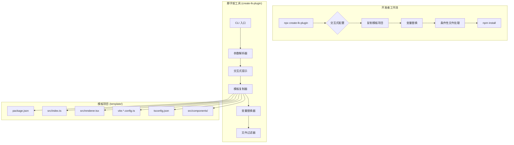

# 设计文档

## 概述

本设计文档描述了 Live Knowledge 插件脚手架系统的技术架构和实现方案。该系统采用**模板项目 + 复制替换**的架构：

1. **模板项目** - 一个真实可运行的 demo 插件项目，位于 `packages/create-lk-plugin/template/`
2. **脚手架工具** - 负责复制模板项目并根据用户配置替换变量、调整文件

这种架构的优势：
- 模板本身是可运行、可测试的真实项目
- 维护简单，直接编辑模板项目即可
- 生成的代码质量有保障
- 避免在代码中硬编码大量模板字符串

## 架构



## 组件和接口

### 1. CLI 入口模块 (cli.ts)

负责解析命令行参数和启动脚手架流程。

```typescript
interface CLIOptions {
  /** 插件名称 (kebab-case) */
  name?: string;
  /** 跳过交互式提示，使用默认值 */
  yes?: boolean;
  /** 指定模板类型 */
  template?: 'full' | 'main-only' | 'renderer-only';
}

/**
 * CLI 入口函数
 * @param args - 命令行参数
 */
async function main(args: string[]): Promise<void>;
```

### 2. 交互式提示模块 (prompts.ts)

使用 inquirer 库实现交互式配置收集。

```typescript
interface PluginConfig {
  /** 插件 ID (kebab-case) */
  id: string;
  /** 插件显示名称 */
  name: string;
  /** 插件描述 */
  description: string;
  /** 插件版本 */
  version: string;
  /** 插件类型 */
  type: 'full' | 'main-only' | 'renderer-only';
  /** 功能选项 */
  features: {
    /** 是否包含侧边栏菜单 */
    sidebar: boolean;
    /** 是否包含独立页面 */
    page: boolean;
    /** 是否包含配置 Schema */
    configSchema: boolean;
    /** 是否包含 HTTP API */
    httpApi: boolean;
  };
}

/**
 * 收集用户配置
 * @param defaults - 默认配置（来自命令行参数）
 * @returns 完整的插件配置
 */
async function collectConfig(defaults?: Partial<PluginConfig>): Promise<PluginConfig>;
```

### 3. 模板复制器模块 (copier.ts)

负责复制模板项目到目标目录。

```typescript
interface CopyOptions {
  /** 源模板目录 */
  templateDir: string;
  /** 目标目录 */
  targetDir: string;
  /** 要排除的文件/目录模式 */
  exclude?: string[];
}

/**
 * 复制模板目录到目标位置
 * @param options - 复制选项
 */
async function copyTemplate(options: CopyOptions): Promise<void>;
```

### 4. 变量替换器模块 (replacer.ts)

负责在复制的文件中替换占位符变量。

```typescript
interface ReplaceContext {
  /** 插件 ID (kebab-case) */
  PLUGIN_ID: string;
  /** 插件类名 (PascalCase) */
  PLUGIN_CLASS_NAME: string;
  /** 插件显示名称 */
  PLUGIN_NAME: string;
  /** 插件描述 */
  PLUGIN_DESCRIPTION: string;
  /** 插件版本 */
  PLUGIN_VERSION: string;
}

/**
 * 在文件内容中替换占位符
 * @param content - 文件内容
 * @param context - 替换上下文
 * @returns 替换后的内容
 */
function replaceVariables(content: string, context: ReplaceContext): string;

/**
 * 处理目录中所有文件的变量替换
 * @param dir - 目标目录
 * @param context - 替换上下文
 */
async function processDirectory(dir: string, context: ReplaceContext): Promise<void>;
```

### 5. 文件过滤器模块 (filter.ts)

根据用户配置删除不需要的文件。

```typescript
interface FilterOptions {
  /** 目标目录 */
  targetDir: string;
  /** 插件配置 */
  config: PluginConfig;
}

/**
 * 根据配置过滤文件
 * - main-only: 删除 renderer 相关文件
 * - renderer-only: 删除 main 相关文件
 * - 根据 features 删除可选功能文件
 * @param options - 过滤选项
 */
async function filterFiles(options: FilterOptions): Promise<void>;
```

### 6. 文件生成器模块 (generator.ts)

整合所有模块，执行完整的项目生成流程。

```typescript
interface GeneratorOptions {
  /** 目标目录 */
  targetDir: string;
  /** 插件配置 */
  config: PluginConfig;
  /** 是否覆盖已存在的文件 */
  overwrite?: boolean;
}

/**
 * 生成插件项目
 * 1. 复制模板项目
 * 2. 替换变量
 * 3. 根据配置过滤文件
 * @param options - 生成器选项
 */
async function generateProject(options: GeneratorOptions): Promise<void>;
```

## 数据模型

### 模板变量占位符

模板项目中使用以下占位符，在生成时会被替换：

| 占位符 | 说明 | 示例 |
|--------|------|------|
| `__PLUGIN_ID__` | 插件 ID (kebab-case) | `my-awesome-plugin` |
| `__PLUGIN_CLASS_NAME__` | 插件类名 (PascalCase) | `MyAwesomePlugin` |
| `__PLUGIN_NAME__` | 插件显示名称 | `My Awesome Plugin` |
| `__PLUGIN_DESCRIPTION__` | 插件描述 | `A plugin that does awesome things` |
| `__PLUGIN_VERSION__` | 插件版本 | `1.0.0` |

### 条件性代码块标记

模板中使用注释标记条件性代码块：

```typescript
// #if FEATURE_CONFIG_SCHEMA
configSchema = { ... };
defaultConfig = { ... };
// #endif FEATURE_CONFIG_SCHEMA

// #if FEATURE_HTTP_API
context.http.router.get("/status", ...);
// #endif FEATURE_HTTP_API
```

## 模板项目结构

```
packages/create-lk-plugin/
├── src/
│   ├── cli.ts           # CLI 入口
│   ├── prompts.ts       # 交互式提示
│   ├── copier.ts        # 模板复制器
│   ├── replacer.ts      # 变量替换器
│   ├── filter.ts        # 文件过滤器
│   ├── generator.ts     # 项目生成器
│   ├── types.ts         # 类型定义
│   └── utils.ts         # 工具函数
├── template/            # 模板项目（真实可运行）
│   ├── package.json
│   ├── tsconfig.json
│   ├── vite.main.config.ts
│   ├── vite.renderer.config.ts
│   ├── eslint.config.mjs
│   ├── README.md
│   └── src/
│       ├── index.ts         # 主进程入口
│       ├── renderer.tsx     # 渲染进程入口
│       ├── env.d.ts         # 类型声明
│       └── components/
│           └── ExamplePage.tsx
└── package.json
```

## 模板文件内容

### template/package.json

```json
{
  "name": "__PLUGIN_ID__",
  "version": "__PLUGIN_VERSION__",
  "description": "__PLUGIN_DESCRIPTION__",
  "main": "./dist/index.js",
  "renderer": "./dist/renderer.global.js",
  "types": "./dist/index.d.ts",
  "scripts": {
    "build": "vite build -c vite.main.config.ts && vite build -c vite.renderer.config.ts",
    "lint": "eslint .",
    "lint:fix": "eslint . --fix",
    "pack": "lk-pack"
  },
  "dependencies": {
    "@live-knowledge/plugin-sdk": "workspace:*",
    "lucide-react": "^0.468.0"
  },
  "devDependencies": {
    "@vitejs/plugin-react": "^4.3.4",
    "typescript": "^5.0.0",
    "vite": "^5.4.21",
    "vite-plugin-dts": "^4.5.4",
    "eslint": "^9.36.0"
  },
  "peerDependencies": {
    "react": "*",
    "react-router-dom": "*"
  }
}
```

### template/src/index.ts (主进程)

```typescript
import {
  LiveKnowledgePlugin,
  PluginContext,
  Action,
} from "@live-knowledge/plugin-sdk";

/**
 * __PLUGIN_NAME__
 * __PLUGIN_DESCRIPTION__
 */
export class __PLUGIN_CLASS_NAME__ implements LiveKnowledgePlugin {
  id = "__PLUGIN_ID__";
  name = "__PLUGIN_NAME__";
  version = "__PLUGIN_VERSION__";
  description = "__PLUGIN_DESCRIPTION__";

  config: Record<string, unknown> = {};

  // #if FEATURE_CONFIG_SCHEMA
  configSchema = {
    type: "object",
    properties: {
      exampleOption: {
        type: "string",
        title: "示例选项",
        description: "这是一个示例配置项",
      },
    },
  };

  defaultConfig = {
    exampleOption: "默认值",
  };
  // #endif FEATURE_CONFIG_SCHEMA

  private context: PluginContext | null = null;

  /**
   * 插件初始化
   * @param context - 插件上下文，提供 AI、IPC、HTTP、数据库等服务
   */
  initialize(context: PluginContext) {
    this.context = context;
    console.log("[__PLUGIN_CLASS_NAME__] 插件已初始化");

    // #if FEATURE_HTTP_API
    // 注册 HTTP API
    context.http.router.get("/status", (_req, res) => {
      res.json({ status: "ok", plugin: this.id });
    });
    // #endif FEATURE_HTTP_API
  }

  hooks = {
    /**
     * 获取插件上下文数据
     */
    getContext: async () => {
      return {
        pluginActive: true,
      };
    },

    /**
     * 丰富 AI 提示词
     */
    enrichPrompt: async () => {
      return `
[__PLUGIN_NAME__]
// 在此添加提示词增强逻辑
      `.trim();
    },

    /**
     * 处理动作
     */
    onAction: async (action: Action) => {
      if (action.type === "__PLUGIN_ID___action") {
        // 处理自定义动作
        return true;
      }
      return false;
    },
  };
}

export default __PLUGIN_CLASS_NAME__;
```

### template/src/renderer.tsx (渲染进程)

```typescript
// #if FEATURE_SIDEBAR
import { Layout } from "lucide-react";
// #endif FEATURE_SIDEBAR
// #if FEATURE_PAGE
import { ExamplePage } from "./components/ExamplePage";
// #endif FEATURE_PAGE

// 注册插件
window.LiveKnowledge.registerPlugin({
  id: "__PLUGIN_ID__",
  routes: [
    // #if FEATURE_PAGE
    {
      path: "/__PLUGIN_ID__",
      element: <ExamplePage />,
    },
    // #endif FEATURE_PAGE
  ],
  // #if FEATURE_SIDEBAR
  sidebarItems: [
    {
      path: "/__PLUGIN_ID__",
      label: "__PLUGIN_NAME__",
      icon: Layout as any,
    },
  ],
  // #endif FEATURE_SIDEBAR
});
```

### template/src/components/ExamplePage.tsx

```typescript
/**
 * __PLUGIN_NAME__ 示例页面组件
 */
export function ExamplePage() {
  return (
    <div className="p-6">
      <h1 className="text-2xl font-bold mb-4">__PLUGIN_NAME__</h1>
      <p className="text-gray-600">__PLUGIN_DESCRIPTION__</p>
      <div className="mt-6">
        {/* 在此添加页面内容 */}
      </div>
    </div>
  );
}
```

## 错误处理

### 错误类型

```typescript
enum ScaffoldErrorCode {
  /** 目标目录已存在 */
  DIR_EXISTS = 'DIR_EXISTS',
  /** 无效的插件名称 */
  INVALID_NAME = 'INVALID_NAME',
  /** 文件写入失败 */
  WRITE_FAILED = 'WRITE_FAILED',
  /** 模板复制失败 */
  COPY_FAILED = 'COPY_FAILED',
  /** 变量替换失败 */
  REPLACE_FAILED = 'REPLACE_FAILED',
}

class ScaffoldError extends Error {
  constructor(
    public code: ScaffoldErrorCode,
    message: string,
  ) {
    super(message);
    this.name = 'ScaffoldError';
  }
}
```

### 错误处理策略

1. **目录已存在**: 提示用户选择覆盖或取消
2. **无效名称**: 显示命名规则并要求重新输入
3. **复制失败**: 显示详细错误信息并清理已创建的文件
4. **替换失败**: 显示文件位置和错误详情

## 正确性属性

*正确性属性是系统在所有有效执行中都应保持为真的特征或行为。*

### Property 1: 项目目录创建

*对于任意* 有效的插件名称（kebab-case 格式），执行脚手架命令后，应该创建一个以该名称命名的目录。

**Validates: Requirements 1.1**

### Property 2: 模板文件完整复制

*对于任意* 有效的插件配置，生成的项目应该包含模板项目中所有适用的文件（根据插件类型过滤后）。

**Validates: Requirements 1.3, 1.4**

### Property 3: 变量替换完整性

*对于任意* 生成的项目文件，不应该包含任何未替换的占位符（`__PLUGIN_*__`）。

**Validates: Requirements 2.7**

### Property 4: Package.json 完整性

*对于任意* 生成的 package.json 文件，应该包含：正确的 main 和 renderer 入口点、@live-knowledge/plugin-sdk 依赖、build/lint/lint:fix/pack 脚本命令。

**Validates: Requirements 3.1, 3.2, 3.3**

### Property 5: 主进程代码结构

*对于任意* 包含主进程的插件配置，生成的 src/index.ts 应该包含：实现 LiveKnowledgePlugin 接口的类、initialize 方法、hooks 对象结构。

**Validates: Requirements 3.4, 3.5**

### Property 6: 渲染进程代码结构

*对于任意* 包含渲染进程的插件配置，生成的 src/renderer.tsx 应该包含 window.LiveKnowledge.registerPlugin 调用。

**Validates: Requirements 3.6**

### Property 7: 条件性功能过滤

*对于任意* 禁用了特定功能的配置，生成的代码不应该包含对应的功能代码块。

**Validates: Requirements 3.7, 4.5**

### Property 8: 插件名称验证

*对于任意* 非 kebab-case 格式的插件名称，脚手架应该拒绝并返回错误。

**Validates: Requirements 1.1 (边界情况)**

### Property 9: 插件类型文件过滤

*对于* main-only 类型的插件，不应该生成 renderer 相关文件；*对于* renderer-only 类型的插件，不应该生成 main 相关文件。

**Validates: Requirements 2.3**

## 测试策略

### 测试方法

本项目采用双重测试策略：

1. **单元测试**: 验证特定示例和边界情况
2. **属性测试**: 验证所有输入的通用属性

### 属性测试框架

使用 **fast-check** 作为 TypeScript/JavaScript 的属性测试库。

### 测试配置

- 每个属性测试最少运行 100 次迭代
- 每个属性测试必须引用设计文档中的属性编号
- 标签格式: **Feature: plugin-scaffold, Property {number}: {property_text}**

### 单元测试覆盖

1. **变量替换测试**
   - 测试所有占位符替换
   - 测试特殊字符处理
   - 测试空值处理

2. **条件块处理测试**
   - 测试 `#if/#endif` 块的正确移除
   - 测试嵌套条件块
   - 测试多个条件块

3. **文件过滤测试**
   - 测试 main-only 过滤
   - 测试 renderer-only 过滤
   - 测试功能选项过滤

### 属性测试覆盖

1. **Property 1, 8**: 插件名称验证和目录创建
2. **Property 2, 3**: 模板复制和变量替换
3. **Property 4-6**: 生成文件结构正确性
4. **Property 7, 9**: 条件性功能和类型过滤

### 集成测试

1. **模板项目测试**: 验证模板项目本身可以成功构建
2. **生成项目测试**: 验证生成的项目可以成功构建
3. **端到端测试**: 验证完整的脚手架流程
