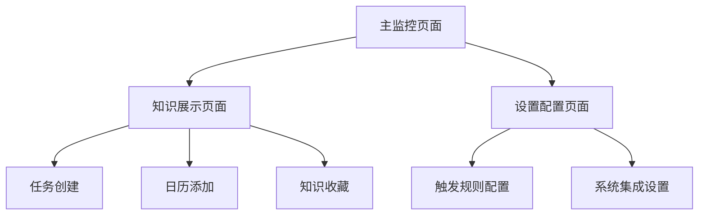

# Live Knowledge - 产品需求文档

## 1. 产品概述

Live Knowledge 是一款智能实时知识提取与增强系统，通过持续监控屏幕内容变化，识别潜在的知识点、任务、会议信息等，将其转化为结构化的 Tag，并通过 AI 引擎实时生成洞察或行动建议。

系统的目标是让用户在任何场景下都能自动获得上下文知识辅助与任务联动能力，实现「知识即现」。核心价值在于让知识“主动出现”而非“被搜索”。

## 2. 核心功能

### 2.1 用户角色

| 角色     | 注册方式   | 核心权限                                   |
| -------- | ---------- | ------------------------------------------ |
| 普通用户 | 邮箱注册   | 使用基础屏幕监控和知识提取功能             |
| 高级用户 | 邀请码升级 | 自定义触发规则、集成第三方系统、高级AI功能 |

### 2.2 功能模块

系统包含以下核心页面：

1. **主监控页面**: 实时屏幕监控、状态显示、触发控制
2. **知识展示页面**: AI生成结果展示、交互操作、历史记录
3. **设置配置页面**: 触发规则配置、集成设置、个性化选项

### 2.3 页面详情

| 页面名称     | 模块名称     | 功能描述                                            |
| ------------ | ------------ | --------------------------------------------------- |
| 主监控页面   | 屏幕监控模块 | 实时监控屏幕内容变化，支持区域选择和全局监控        |
| 主监控页面   | 状态指示器   | 显示当前监控状态、最近触发时间、系统性能指标        |
| 主监控页面   | 触发控制器   | 提供手动触发、暂停/恢复监控、紧急停止功能           |
| 知识展示页面 | 结果展示面板 | 以悬浮窗、侧边栏或气泡形式展示AI生成的知识和建议    |
| 知识展示页面 | 交互操作区   | 支持收藏、复制、创建任务、添加到日历等操作          |
| 知识展示页面 | 历史记录     | 显示过往提取的知识点和用户交互历史                  |
| 设置配置页面 | 触发规则设置 | 配置debounce、throttle、去重策略等参数              |
| 设置配置页面 | 集成配置     | 配置与Notion、Obsidian、Slack、Calendar等系统的连接 |
| 设置配置页面 | 个性化选项   | 自定义展示样式、AI模型选择、语言偏好                |

### 2.4 插件系统

- **输入端插件**：支持可插拔采集能力；默认提供基础 `Screen Watcher`，同时开放浏览器 DOM 监听、应用适配器（VSCode/Zoom）与 Webhook 数据源等插件形态。
- **消费端插件**：知识呈现层开放插件机制，支持 Overlay、Sidebar、Bubble 等自定义渲染器；支持外部同步插件（Notion/Slack/Calendar 等）。
- **AI 能力开放**：AI Engine 除主动推送外，提供上下文查询接口，对所有插件开放（需权限）。
- **开发者模式**：提供插件注册/订阅接口与权限模型，支持 `manifest` 声明权限与订阅主题。

## 3. 核心流程

### 主要用户操作流程：

1. **启动监控流程**: 用户打开应用 → 选择监控模式 → 系统开始屏幕监控 → 实时状态显示
2. **知识提取流程**: 屏幕内容变化 → 内容稳定检测 → 知识提取分析 → AI生成洞察 → 结果展示
3. **交互操作流程**: 用户查看展示结果 → 选择相应操作（创建任务/添加日历等）→ 系统执行操作 → 反馈确认

### 页面导航流程：

## 4. 用户界面设计

### 4.1 设计风格

- **主色调**: 深蓝色 (#1E3A8A) 和白色为主，辅以绿色 (#10B981) 表示成功状态
- **按钮样式**: 圆角设计，主要操作为实心按钮，次要操作为边框按钮
- **字体**: 优先使用系统默认字体，标题16px，正文14px，小字12px
- **布局风格**: 卡片式布局，支持拖拽和调整大小
- **图标风格**: 使用简洁的线性图标，支持暗色模式

### 4.2 页面设计概述

| 页面名称     | 模块名称     | UI元素                                                            |
| ------------ | ------------ | ----------------------------------------------------------------- |
| 主监控页面   | 屏幕监控模块 | 半透明显示区域选择框，支持拖拽调整大小，边框使用蓝色高亮          |
| 主监控页面   | 状态指示器   | 顶部状态栏显示监控图标、运行时间、触发次数，使用绿色/红色表示状态 |
| 主监控页面   | 触发控制器   | 底部悬浮控制面板，包含开始/暂停按钮、设置入口、最小化按钮         |
| 知识展示页面 | 结果展示面板 | 右侧滑出式侧边栏，宽度300px，支持透明度调节，卡片式结果展示       |
| 知识展示页面 | 交互操作区   | 每个结果卡片底部包含操作按钮组，支持一键执行任务创建等操作        |
| 知识展示页面 | 历史记录     | 时间轴式布局，支持搜索和筛选，可展开查看详细信息                  |

### 4.3 响应式设计

- **桌面优先**: 主要面向桌面用户，支持Windows、macOS、Linux
- **自适应布局**: 支持不同屏幕尺寸，最小窗口尺寸400x300px
- **触控优化**: 支持触控操作，按钮最小点击区域44x44px

## 5. 技术实现要求

### 5.1 性能指标

- 误触发率 < 5%
- 响应延迟 < 2秒
- 上下文识别准确率 > 90%
- 重复触发率 < 3%
- 内存占用 < 500MB

### 5.4 插件与接口要求

- 插件注册：`POST /api/plugins/register`（提交 manifest，返回 `pluginId` 与令牌）
- 事件订阅：`POST /api/plugins/subscribe`（订阅 `screen.change`、`content.extracted`、`ai.insight`、`present.render` 等）
- 上下文查询：`GET /api/ai/context?window=<n>&keys=<k1,k2>`（对插件开放）
- 主动推送：`POST /api/ai/push`（由插件推送洞察/行动进入系统队列）
- 安全与权限：最小权限、令牌校验、沙箱隔离与速率限制；审计日志需可查。

### 5.2 兼容性要求

- 支持主流操作系统：Windows 10+, macOS 10.15+, Ubuntu 18.04+
- 支持多语言：中文、英文优先
- 支持多显示器配置
- 支持高DPI显示

### 5.3 安全与隐私

- 本地数据处理优先，敏感信息不上传
- 支持数据加密存储
- 提供隐私模式，暂停所有数据收集
- 支持数据导出和删除
