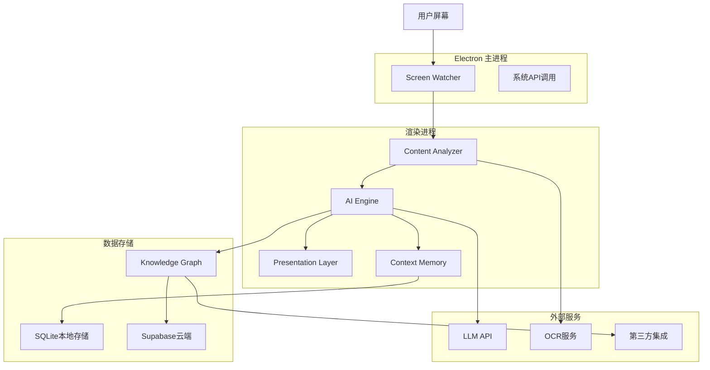
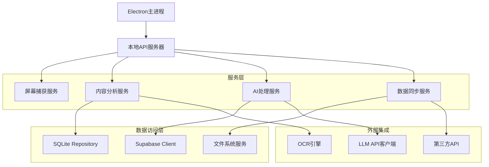
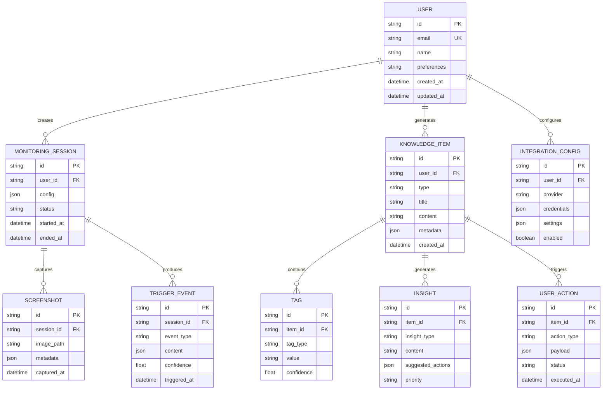

# Live Knowledge - 技术架构文档

## 1. 架构设计



## 2. 技术栈描述

- **前端**: Electron + React\@latest + TypeScript + TailwindCSS

- **初始化工具**: electron-vite（https://electron-vite.org/guide/）

- **后端**: Node.js + Express (本地API服务)

- **数据库**: SQLite (本地) + Supabase (云端同步)

- **AI/ML**: OpenAI GPT-4 API + Hugging Face Transformers

- **OCR**: Tesseract.js + PaddleOCR

- **状态管理**: Zustand + React Query

- **UI组件**: Radix UI + Lucide React图标

## 3. 路由定义

| 路由       | 用途                                     |
| ---------- | ---------------------------------------- |
| /          | 主监控界面，显示实时屏幕监控状态         |
| /dashboard | 知识展示面板，显示AI生成的洞察和建议     |
| /settings  | 系统设置页面，配置触发规则和集成选项     |
| /history   | 历史记录页面，查看过往提取的知识点       |
| /overlay   | 悬浮窗展示层，用于在其他应用上层显示结果 |

## 4. API定义

### 4.1 屏幕监控API

```typescript
// 开始监控
POST /api/monitor/start
Request:
{
  region?: { x: number; y: number; width: number; height: number },
  mode: 'full' | 'region' | 'window',
  triggerConfig: {
    debounce: number,
    throttle: number,
    similarityThreshold: number
  }
}

Response:
{
  success: boolean,
  sessionId: string,
  status: 'monitoring' | 'paused' | 'stopped'
}
```

### 4.2 内容分析API

```typescript
// 分析屏幕内容
POST /api/analyze/content
Request:
{
  imageData: string, // base64 encoded screenshot
  textContent: string,
  context: string[],
  previousTags: Tag[]
}

Response:
{
  tags: Tag[],
  insights: Insight[],
  confidence: number,
  processingTime: number
}

interface Tag {
  type: 'meeting_schedule' | 'task_todo' | 'topic_discussion' | 'data_table' | 'problem_solving' | 'insight_context',
  title: string,
  content: string,
  metadata: Record<string, any>,
  timestamp: string,
  confidence: number
}
```

### 4.3 AI引擎API

```typescript
// 生成洞察和建议
POST /api/ai/generate-insights
Request:
{
  tags: Tag[],
  context: ContextWindow,
  userPreferences: UserPreferences
}

Response:
{
  insights: Insight[],
  actions: Action[],
  explanation: string
}

interface Insight {
  id: string,
  type: 'task' | 'schedule' | 'note' | 'analysis' | 'reminder',
  title: string,
  content: string,
  priority: 'low' | 'medium' | 'high',
  suggestedActions: Action[],
  metadata: Record<string, any>
}

interface Action {
  type: 'create_task' | 'add_calendar' | 'save_note' | 'send_notification',
  payload: Record<string, any>,
  confirmationRequired: boolean
}
```

## 5. 服务器架构



## 6. 数据模型

### 6.1 核心实体关系



### 6.2 数据定义语言

```sql
-- 用户表
CREATE TABLE users (
    id UUID PRIMARY KEY DEFAULT gen_random_uuid(),
    email VARCHAR(255) UNIQUE NOT NULL,
    name VARCHAR(100) NOT NULL,
    preferences JSONB DEFAULT '{}',
    plan VARCHAR(20) DEFAULT 'free' CHECK (plan IN ('free', 'premium')),
    created_at TIMESTAMP WITH TIME ZONE DEFAULT NOW(),
    updated_at TIMESTAMP WITH TIME ZONE DEFAULT NOW()
);

-- 监控会话表
CREATE TABLE monitoring_sessions (
    id UUID PRIMARY KEY DEFAULT gen_random_uuid(),
    user_id UUID REFERENCES users(id) ON DELETE CASCADE,
    config JSONB NOT NULL,
    status VARCHAR(20) NOT NULL CHECK (status IN ('active', 'paused', 'stopped')),
    started_at TIMESTAMP WITH TIME ZONE DEFAULT NOW(),
    ended_at TIMESTAMP WITH TIME ZONE,
    created_at TIMESTAMP WITH TIME ZONE DEFAULT NOW()
);

-- 知识项表
CREATE TABLE knowledge_items (
    id UUID PRIMARY KEY DEFAULT gen_random_uuid(),
    user_id UUID REFERENCES users(id) ON DELETE CASCADE,
    type VARCHAR(50) NOT NULL,
    title VARCHAR(255) NOT NULL,
    content TEXT NOT NULL,
    metadata JSONB DEFAULT '{}',
    confidence FLOAT DEFAULT 0.0,
    created_at TIMESTAMP WITH TIME ZONE DEFAULT NOW()
);

-- 标签表
CREATE TABLE tags (
    id UUID PRIMARY KEY DEFAULT gen_random_uuid(),
    item_id UUID REFERENCES knowledge_items(id) ON DELETE CASCADE,
    tag_type VARCHAR(50) NOT NULL,
    value VARCHAR(255) NOT NULL,
    confidence FLOAT DEFAULT 0.0,
    created_at TIMESTAMP WITH TIME ZONE DEFAULT NOW()
);

-- 洞察表
CREATE TABLE insights (
    id UUID PRIMARY KEY DEFAULT gen_random_uuid(),
    item_id UUID REFERENCES knowledge_items(id) ON DELETE CASCADE,
    insight_type VARCHAR(50) NOT NULL,
    title VARCHAR(255) NOT NULL,
    content TEXT NOT NULL,
    suggested_actions JSONB DEFAULT '[]',
    priority VARCHAR(20) DEFAULT 'medium' CHECK (priority IN ('low', 'medium', 'high')),
    created_at TIMESTAMP WITH TIME ZONE DEFAULT NOW()
);

-- 用户操作表
CREATE TABLE user_actions (
    id UUID PRIMARY KEY DEFAULT gen_random_uuid(),
    item_id UUID REFERENCES knowledge_items(id) ON DELETE CASCADE,
    action_type VARCHAR(50) NOT NULL,
    payload JSONB NOT NULL,
    status VARCHAR(20) DEFAULT 'pending' CHECK (status IN ('pending', 'completed', 'failed')),
    executed_at TIMESTAMP WITH TIME ZONE,
    created_at TIMESTAMP WITH TIME ZONE DEFAULT NOW()
);

-- 集成配置表
CREATE TABLE integration_configs (
    id UUID PRIMARY KEY DEFAULT gen_random_uuid(),
    user_id UUID REFERENCES users(id) ON DELETE CASCADE,
    provider VARCHAR(50) NOT NULL,
    credentials JSONB NOT NULL,
    settings JSONB DEFAULT '{}',
    enabled BOOLEAN DEFAULT true,
    created_at TIMESTAMP WITH TIME ZONE DEFAULT NOW(),
    updated_at TIMESTAMP WITH TIME ZONE DEFAULT NOW()
);

-- 创建索引
CREATE INDEX idx_knowledge_items_user_id ON knowledge_items(user_id);
CREATE INDEX idx_knowledge_items_type ON knowledge_items(type);
CREATE INDEX idx_knowledge_items_created_at ON knowledge_items(created_at DESC);
CREATE INDEX idx_tags_item_id ON tags(item_id);
CREATE INDEX idx_tags_tag_type ON tags(tag_type);
CREATE INDEX idx_insights_item_id ON insights(item_id);
CREATE INDEX idx_user_actions_item_id ON user_actions(item_id);
CREATE INDEX idx_monitoring_sessions_user_id ON monitoring_sessions(user_id);
CREATE INDEX idx_integration_configs_user_id ON integration_configs(user_id);
```

## 7. 关键技术实现

### 7.1 屏幕捕获与变化检测

```typescript
class ScreenWatcher {
  private captureRegion: Rectangle;
  private lastScreenshot: Buffer;
  private similarityThreshold: number = 0.85;

  async captureScreen(): Promise<Buffer> {
    // 使用Electron的desktopCapturer
    const sources = await desktopCapturer.getSources({
      types: ["screen"],
      thumbnailSize: { width: 1920, height: 1080 },
    });

    return sources[0].thumbnail.toPNG();
  }

  async detectChanges(): Promise<boolean> {
    const currentScreenshot = await this.captureScreen();

    if (!this.lastScreenshot) {
      this.lastScreenshot = currentScreenshot;
      return true;
    }

    const similarity = await this.calculateSimilarity(
      this.lastScreenshot,
      currentScreenshot,
    );

    const hasSignificantChange = similarity < this.similarityThreshold;

    if (hasSignificantChange) {
      this.lastScreenshot = currentScreenshot;
    }

    return hasSignificantChange;
  }

  private async calculateSimilarity(
    img1: Buffer,
    img2: Buffer,
  ): Promise<number> {
    // 使用感知哈希算法计算图像相似度
    const hash1 = await this.calculatePerceptualHash(img1);
    const hash2 = await this.calculatePerceptualHash(img2);

    return this.hammingDistance(hash1, hash2) / 64; // 64位哈希
  }
}
```

### 7.2 OCR与文本提取

```typescript
class ContentExtractor {
  private tesseractWorker: Tesseract.Worker;

  async extractTextFromImage(imageBuffer: Buffer): Promise<string> {
    try {
      const result = await this.tesseractWorker.recognize(imageBuffer, {
        lang: "chi_sim+eng", // 中英文支持
        oem: 1, // LSTM OCR引擎
        psm: 6, // 统一文本块
      });

      return result.data.text;
    } catch (error) {
      console.error("OCR extraction failed:", error);
      throw error;
    }
  }

  async extractStructuredContent(text: string): Promise<Tag[]> {
    const tags: Tag[] = [];

    // 使用正则表达式和NLP模型提取结构化信息
    const patterns = {
      meeting: /会议|meeting|讨论|discuss/gi,
      task: /任务|task|待办|todo|完成|complete/gi,
      schedule: /日程|schedule|时间|time|日期|date/gi,
      problem: /问题|problem|bug|错误|error/gi,
      data: /数据|data|表格|table|图表|chart/gi,
    };

    for (const [type, pattern] of Object.entries(patterns)) {
      if (pattern.test(text)) {
        tags.push({
          type: type as TagType,
          title: this.extractTitle(text, type),
          content: text,
          confidence: this.calculateConfidence(text, pattern),
          metadata: { extractedAt: new Date().toISOString() },
        });
      }
    }

    return tags;
  }
}
```

### 7.3 AI引擎实现

```typescript
class AIEngine {
  private openai: OpenAI;
  private contextStore: ContextMemory;

  async generateInsights(
    tags: Tag[],
    context: ContextWindow,
  ): Promise<Insight[]> {
    const prompt = this.buildPrompt(tags, context);

    try {
      const response = await this.openai.chat.completions.create({
        model: "gpt-4-turbo-preview",
        messages: [
          {
            role: "system",
            content: `你是一个智能知识助手，能够根据屏幕内容提取有价值的洞察和行动建议。
            请分析提供的内容，并生成结构化的洞察和建议。`,
          },
          {
            role: "user",
            content: prompt,
          },
        ],
        temperature: 0.3,
        max_tokens: 1000,
        response_format: { type: "json_object" },
      });

      const result = JSON.parse(response.choices[0].message.content);
      return this.parseInsights(result);
    } catch (error) {
      console.error("AI insight generation failed:", error);
      throw error;
    }
  }

  private buildPrompt(tags: Tag[], context: ContextWindow): string {
    return `
    屏幕内容标签：${JSON.stringify(tags, null, 2)}
    
    上下文信息：${JSON.stringify(context.recentContexts, null, 2)}
    
    请生成结构化的洞察和建议，格式如下：
    {
      "insights": [
        {
          "type": "task|schedule|note|analysis|reminder",
          "title": "洞察标题",
          "content": "详细内容",
          "priority": "low|medium|high",
          "suggestedActions": [
            {
              "type": "create_task|add_calendar|save_note|send_notification",
              "description": "建议操作描述"
            }
          ]
        }
      ]
    }
    `;
  }
}
```

## 8. 部署与配置

### 8.1 环境要求

- Node.js >= 18.0.0

- Electron >= 28.0.0

- 内存: 最少4GB，推荐8GB

- 存储: 最少1GB可用空间

- 网络: 稳定的互联网连接（用于AI API调用）

### 8.2 构建配置

```json
{
  "build": {
    "appId": "com.liveknowledge.app",
    "productName": "Live Knowledge",
    "directories": {
      "output": "dist"
    },
    "files": ["build/**/*", "node_modules/**/*", "package.json"],
    "mac": {
      "category": "public.app-category.productivity",
      "target": "dmg"
    },
    "win": {
      "target": "nsis"
    },
    "linux": {
      "target": "AppImage"
    }
  }
}
```

### 8.3 安全配置

- API密钥加密存储

- 用户数据本地加密

- 支持代理配置

- 自动更新机制

## 9. 插件架构与接口

### 9.1 插件中心（Plugin Registry）

- 负责插件的安装、注册、启用/禁用、权限校验与沙箱隔离
- 插件以 `manifest.json` 声明基础信息、权限与订阅主题
- 注册后分配 `pluginId` 与访问令牌（仅用于插件 API 调用）

示例 `manifest`：

```json
{
  "name": "lk.overlay.basic",
  "version": "0.1.0",
  "permissions": ["ai.context.read", "ai.push.write", "present.overlay"],
  "subscriptions": ["ai.insight", "present.render"],
  "config": { "position": "right", "width": 320 }
}
```

### 9.2 事件总线（Event Bus Topics）

- `screen.change`：屏幕/DOM 变化事件（输入插件）
- `content.extracted`：结构化内容（tags）
- `ai.insight`：AI Engine 输出的洞察/行动
- `present.render`：渲染请求（消费插件）
- `action.execute`：用户确认后的执行动作

### 9.3 插件 API 定义

```typescript
// 插件注册
POST /api/plugins/register
Request: {
  manifest: Manifest
}
Response: {
  pluginId: string,
  token: string,
  enabled: boolean
}

// 订阅事件主题
POST /api/plugins/subscribe
Request: {
  pluginId: string,
  topics: string[]
}
Response: { success: boolean }

// AI Engine 上下文查询（对所有插件开放，需权限）
GET /api/ai/context?window=number&keys=string[]
Response: {
  recentContexts: string[],
  knowledgeItems: KnowledgeItem[],
  session: { id: string, startedAt: string }
}

// 插件主动推送洞察/行动（进入系统队列与展示层）
POST /api/ai/push
Request: {
  pluginId: string,
  insights: Insight[],
  actions: Action[]
}
Response: { queued: boolean, ids: string[] }

// 呈现层渲染请求（消费插件使用）
POST /api/present/render
Request: {
  pluginId: string,
  layout: 'overlay' | 'sidebar' | 'bubble',
  payload: Record<string, any>
}
Response: { success: boolean }
```

### 9.4 安全与权限模型

- 最小权限：仅授予 `ai.context.read`、`ai.push.write`、`present.overlay/sidebar` 等必要权限
- 沙箱执行：插件运行环境隔离，禁用不必要的系统访问
- 令牌校验：所有插件 API 需携带 `Authorization: Bearer <token>`
- 配额与限流：对推送与渲染调用施加速率限制与队列
- 审计追踪：记录注册、订阅、查询与渲染行为

### 9.5 示例：消费插件渲染流程

1. 插件注册并订阅 `ai.insight` 与 `present.render`
2. 收到 `ai.insight` 后调用 `GET /api/ai/context` 获取上下文窗口
3. 根据策略将洞察与上下文合并为 UI 数据结构
4. 调用 `POST /api/present/render` 以 `overlay` 模式渲染
5. 用户交互后由系统触发 `action.execute` 写入外部系统（如 Calendar/Notion）
