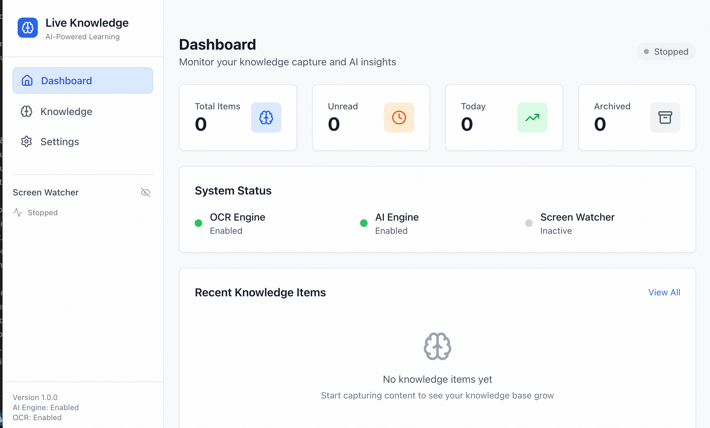
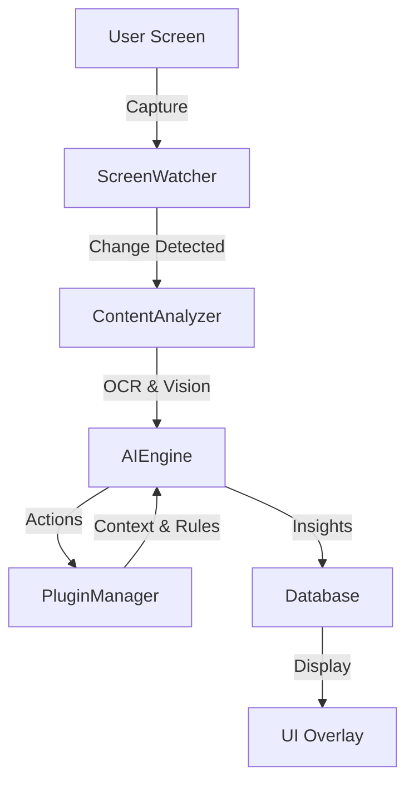
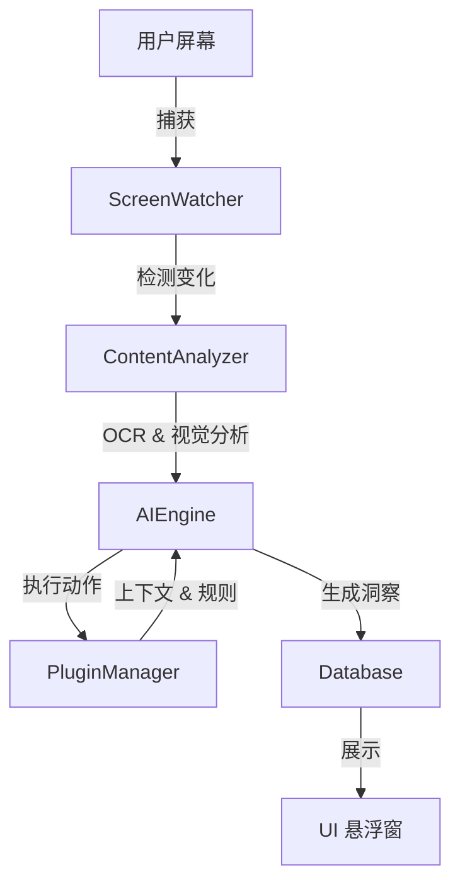

# Live Knowledge

[](https://deepwiki.com/GrinZero/live-knowledge)

[English](#english) | [中文](#chinese)

<a name="english"></a>

**Live Knowledge** is an intelligent, real-time screen context awareness system. It continuously monitors your screen content, extracts meaningful information (tasks, meetings, insights) using AI, and provides proactive assistance without interrupting your workflow.



## 🌟 Key Features

- **👁️ Real-time Screen Monitoring**: Intelligently detects screen changes and captures context using visual analysis.
- **🧠 AI-Powered Analysis**: Uses multimodal AI (OpenAI GPT-4o or Google Gemini 1.5 Pro/Flash) to understand screen content, not just OCR text.
- **🔌 Extensible Plugin System**: Customize behavior with plugins. Add new context sources, modify AI prompts, or trigger external actions (Linear, Notion, etc.).
- **🔒 Privacy-First**: Screenshots and data are stored locally (SQLite). AI analysis is performed via secure API calls with optional local fallbacks.
- **⚡ Low Intrusion**: "Knowledge as you need it" - insights appear only when relevant via non-intrusive overlays.
- **📊 Insight Dashboard**: Review past insights, tracked tasks, and knowledge history.

## 🛠️ Technical Architecture

Live Knowledge is built as a modern Electron application:

- **Frontend**: Electron + React 19 + TypeScript + TailwindCSS (Vite)
- **Backend (Main Process)**: Node.js
  - **Screen Watcher**: Efficient screen capture and difference detection.
  - **Content Analyzer**: Hybrid analysis using local OCR (Tesseract.js) and Cloud AI (OpenAI/Gemini).
  - **AI Engine**: Manages context windows, prompt engineering, and LLM interactions.
  - **Plugin Manager**: Robust plugin lifecycle management (load, hooks, sandboxing).
  - **Database**: SQLite for local persistence of sessions, insights, and knowledge items.
  - **API Server**: Local Express server (port 3000) for external integrations.

### Data Flow



## 🚀 Getting Started

### Prerequisites

- Node.js >= 18.0.0
- pnpm (recommended) or npm
- OpenAI API Key or Google Gemini API Key

### Installation

1.  **Clone the repository**

    ```bash
    git clone https://github.com/your-org/live-knowledge.git
    cd live-knowledge
    ```

2.  **Install dependencies**

    ```bash
    pnpm install
    ```

3.  **Configuration**
    Create a `.env` file in the root directory (optional, can also be configured in UI settings):

    ```env
    # Choose your provider: 'openai' or 'gemini'
    AI_PROVIDER=gemini

    # API Keys
    OPENAI_API_KEY=sk-...
    GEMINI_API_KEY=...

    # Model selection (optional)
    AI_MODEL=gemini-1.5-flash
    ```

4.  **Run Development Mode**

    ```bash
    pnpm dev
    ```

5.  **Build for Production**
    ```bash
    pnpm build
    ```

## 🧩 Plugin System

Live Knowledge is designed to be extensible. Plugins can:

- **Inject Context**: Provide extra data to the AI (e.g., "Current Git Branch", "Calendar Events").
- **Enrich Prompts**: Add custom rules for analysis (e.g., "If you see a bug report, extract the error code").
- **Handle Actions**: Execute tasks (e.g., "Create Linear Issue", "Save to Notion").

See [Plugin System Architecture](.trae/documents/Plugin%20System%20Architecture.md) for development guides.

## 📄 Documentation

- [Technical Design](tech-design.md): Detailed system architecture and module breakdown.
- [Product SOP](sop.md): Product vision, requirements, and user flows.
- [Plugin SDK](packages/plugin-sdk/README.md): Guide for creating plugins.

---

<a name="chinese"></a>

# Live Knowledge (中文介绍)

**Live Knowledge** 是一款智能的实时屏幕上下文感知系统。它能持续监控您的屏幕内容，利用 AI 提取关键信息（如任务、会议、洞察），并在不打断工作流的情况下提供主动辅助。

## 🌟 核心特性

- **👁️ 实时屏幕监控**：智能检测屏幕变化，并通过视觉分析捕获上下文。
- **🧠 AI 驱动分析**：使用多模态 AI（OpenAI GPT-4o 或 Google Gemini 1.5 Pro/Flash）深度理解屏幕内容，不仅仅是 OCR 文字识别。
- **🔌 可扩展插件系统**：通过插件自定义行为。支持添加新的上下文源、修改 AI 提示词（Prompt）或触发外部动作（如同步到 Linear, Notion 等）。
- **🔒 隐私优先**：截图和数据均存储在本地（SQLite）。AI 分析通过安全的 API 调用进行，并提供可选的本地回退方案。
- **⚡ 低侵入性**：“按需呈现知识”——仅在相关时通过非侵入式悬浮窗展示洞察。
- **📊 洞察仪表盘**：回顾历史洞察、追踪任务和知识记录。

## 🛠️ 技术架构

Live Knowledge 基于现代 Electron 技术栈构建：

- **前端**：Electron + React 19 + TypeScript + TailwindCSS (Vite)
- **后端（主进程）**：Node.js
  - **Screen Watcher**：高效的屏幕捕获与差异检测。
  - **Content Analyzer**：混合分析引擎，结合本地 OCR (Tesseract.js) 和云端 AI (OpenAI/Gemini)。
  - **AI Engine**：管理上下文窗口、提示词工程及 LLM 交互。
  - **Plugin Manager**：强大的插件生命周期管理（加载、Hook、沙箱）。
  - **Database**：SQLite 用于本地持久化会话、洞察和知识条目。
  - **API Server**：本地 Express 服务器（端口 3000），用于外部集成。

### 数据流向



## 🚀 快速开始

### 前置要求

- Node.js >= 22.0.0
- pnpm (推荐) 或 npm
- OpenAI API Key 或 Google Gemini API Key

### 安装步骤

1.  **克隆仓库**

    ```bash
    git clone https://github.com/your-org/live-knowledge.git
    cd live-knowledge
    ```

2.  **安装依赖**

    ```bash
    pnpm install
    ```

3.  **配置**
    在根目录创建 `.env` 文件（可选，也可以在 UI 设置中配置）：

    ```env
    # 选择提供商: 'openai' 或 'gemini'
    AI_PROVIDER=gemini

    # API Keys
    OPENAI_API_KEY=sk-...
    GEMINI_API_KEY=...

    # 模型选择 (可选)
    AI_MODEL=gemini-1.5-flash
    ```

4.  **运行开发模式**

    ```bash
    pnpm dev
    ```

5.  **构建生产版本**
    ```bash
    pnpm build
    ```

## 🧩 插件系统

Live Knowledge 设计为高度可扩展。插件可以：

- **注入上下文**：向 AI 提供额外数据（例如“当前 Git 分支”、“日历事件”）。
- **增强提示词**：添加自定义分析规则（例如“如果看到 Bug 报告，提取错误代码”）。
- **处理动作**：执行具体任务（例如“创建 Linear工单”、“保存到 Notion”）。

开发指南请参阅 [插件系统架构](.trae/documents/Plugin%20System%20Architecture.md)。

## 📄 文档资源

- [技术设计文档 (Technical Design)](tech-design.md)：详细的系统架构与模块拆解。
- [产品 SOP (Product SOP)](sop.md)：产品愿景、需求与用户流程。
- [插件 SDK](packages/plugin-sdk/README.md)：插件开发指南。

## 🤝 贡献指南

欢迎贡献代码！请阅读我们的贡献指南并提交 PR。

## 📄 许可证

MIT
