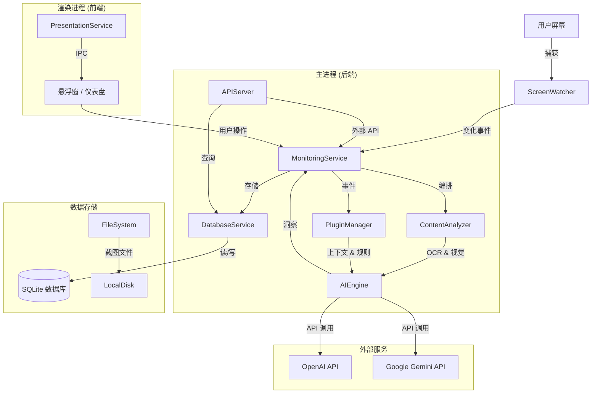

# Live Knowledge - 技术架构文档

## 1. 架构设计

### 1.1 系统总体架构



### 1.2 核心模块职责

| 模块                  | 职责                                                   | 关键技术                                                  |
| :-------------------- | :----------------------------------------------------- | :-------------------------------------------------------- |
| **MonitoringService** | 中央协调器。管理捕获循环，协调分析流程，处理各类事件。 | Node.js `EventEmitter`, `setTimeout` 循环                 |
| **ScreenWatcher**     | 捕获屏幕内容并检测显著变化。                           | Electron `desktopCapturer`, 感知哈希 (Perceptual Hash)    |
| **ContentAnalyzer**   | 从图像提取文本和结构。支持“混合 OCR + AI”模式。        | `tesseract.js` (本地 OCR), `AIEngine` (视觉分析)          |
| **AIEngine**          | 对接 LLM 进行场景理解、洞察生成和逻辑推理。            | OpenAI SDK, Google Generative AI SDK, `https-proxy-agent` |
| **PluginManager**     | 管理插件生命周期、Hook 挂载及沙箱执行。                | 动态 `require`, `vm` (概念上), 自定义 Hook                |
| **DatabaseService**   | 本地持久化知识、会话和配置信息。                       | `sqlite3`, SQL 查询                                       |
| **APIServer**         | 本地 HTTP 服务器，用于外部集成和控制。                 | `express`                                                 |

---

## 2. 技术栈

- **前端**: Electron 39 + React 19 + TypeScript + TailwindCSS 4 (Vite 6)
- **后端**: Node.js (Electron 主进程)
- **数据库**: SQLite (通过 `sqlite3`)
- **AI/ML**:
  - OpenAI GPT-4o / GPT-4-Turbo
  - Google Gemini 1.5 Pro / Flash
  - 本地 OCR: Tesseract.js v6
- **通信**: Electron IPC (进程间通信), 本地 HTTP 服务器 (Express)
- **状态管理**: Zustand + React Query (前端)

---

## 3. 数据流与处理管线

### 3.1 "上下文循环" (Context Loop)

1.  **检测 (Detection)**: `ScreenWatcher` 按间隔（默认 1.5s）捕获屏幕。计算感知哈希。若哈希差异 > 阈值 (0.15)，触发 **Change Event**。
2.  **上下文捕获窗口 (Capture Window)**: `MonitoringService` 开启“捕获窗口”（如 6 秒）。它会连续捕获多帧，以理解动作的*流向*（不仅仅是静态快照）。
3.  **聚合与分析 (Aggregation)**:
    - 所有帧发送至 `ContentAnalyzer`。
    - **多模态分析**: 若开启 AI，帧 + OCR 文本发送至 LLM (如 Gemini 1.5 Pro) 生成“场景摘要”并提取“标签 (Tags)”。
    - **回退模式**: 若 AI 离线，使用 Tesseract.js 提取文本，并通过正则规则提取标签。
4.  **插件增强 (Plugin Enrichment)**:
    - `PluginManager.getContexts()`: 插件注入外部上下文（如“当前 IDE 文件”、“即将开始的日历事件”）。
    - `PluginManager.getPromptAdditions()`: 插件注入自定义系统提示词规则。
5.  **洞察生成 (Insight Generation)**:
    - 调用 `AIEngine.generateInsights()`，输入包括：`[屏幕标签] + [屏幕文本] + [插件上下文] + [最近历史]`。
    - LLM 生成结构化的 `Insights`（任务、笔记、建议）和 `SuggestedActions`。
6.  **动作执行 (Action Execution)**:
    - 洞察存入 SQLite。
    - 若存在 `SuggestedActions`，尝试调用 `PluginManager.executeAction()`（允许插件处理“创建 Jira 工单”等操作）。
7.  **呈现 (Presentation)**:
    - `PresentationService` 通过 IPC 将洞察发送至前端。
    - UI 展示非侵入式的悬浮窗或气泡。

---

## 4. 插件系统架构

插件系统允许在不修改核心代码的情况下扩展系统能力。

### 4.1 插件结构 (`package.json`)

```json
{
  "name": "my-plugin",
  "main": "dist/index.js",
  "meta": {
    "type": "context-provider", // 或 'action-handler'
    "permissions": ["screen.read", "ai.context"]
  }
}
```

### 4.2 核心 Hooks

插件需实现 `LiveKnowledgePlugin` 接口：

- **`hooks.getContext()`**: 在 AI 分析前调用。返回一个 JSON 对象以注入 LLM 上下文。
  - _示例_: Git 插件返回 `{ git: { branch: "feature/login", status: "dirty" } }`。
- **`hooks.enrichPrompt(context)`**: 在构建系统提示词时调用。返回字符串指令。
  - _示例_: “如果你在文本中看到堆栈跟踪，请将其提取为 'Bug Report' 标签。”
- **`hooks.onAction(action)`**: 当 AI 建议执行某动作时调用。
  - _示例_: 处理动作 `{ type: "create_linear_issue", payload: { title: "..." } }`。
- **`hooks.onEvent(event, payload)`**: 在系统事件（`knowledge_created`, `insight_generated`）触发时调用。

### 4.3 插件生命周期

1.  **发现**: 从 `userData/plugins` 目录加载插件（支持 `.zip`, `.tgz`, 或文件夹）。
2.  **注册**: `PluginManager` 加载 JS 模块并注册实例。
3.  **初始化**: 调用 `plugin.initialize(context)`，提供 `ipc`, `http` (路由), 和 `ai` 能力的访问权限。

---

## 5. 数据库设计 (SQLite)

### 5.1 关键表结构

- **`monitoring_sessions`**: 记录使用会话（开始/结束时间、配置）。
- **`knowledge_items`**: 捕获信息的原始单元。
  - `type`: 'meeting', 'task', 'code', 'error' 等。
  - `content`: 完整文本或摘要。
  - `metadata`: JSON（截图路径、来源应用）。
- **`tags`**: 从知识条目中提取的结构化实体（如具体日期、人名）。
- **`insights`**: AI 基于知识条目得出的高层结论。
  - `priority`: 'high', 'medium', 'low'。
  - `suggested_actions`: 可执行步骤的 JSON 数组。
- **`screenshots`**: 磁盘上图片文件的引用。

---

## 6. API 参考 (本地服务器)

应用运行一个本地 Express 服务器（默认端口 3000）用于外部控制。

### 6.1 监控控制

- `POST /api/monitor/start`: 开始监控会话。
- `POST /api/monitor/stop`: 停止监控。
- `GET /api/monitor/status`: 获取当前状态和统计。

### 6.2 知识与洞察

- `GET /api/knowledge/recent`: 获取最近捕获的条目。
- `GET /api/insights/recent`: 获取最近的 AI 洞察。
- `GET /api/search?q=...`: 对本地知识进行语义/文本搜索。

### 6.3 插件管理

- `GET /api/plugins`: 列出已安装插件。
- `POST /api/plugins/:id/toggle`: 启用/禁用插件。
- `POST /api/plugins/install`: 从文件路径安装插件。

---

## 7. 安全与隐私

- **本地存储**: 所有截图和数据库记录均存储在用户的本地 AppData 文件夹中。
- **可控 AI 访问**:
  - 用户需提供自己的 API Key (OpenAI/Gemini)。
  - 仅在设置开启时，图片才会发送给 AI 提供商。
  - 未来将实现“隐私模式”，暂停对特定应用的捕获。
- **插件沙箱**: 插件目前在主进程运行，但应经过审计。未来版本将引入隔离的执行上下文。
